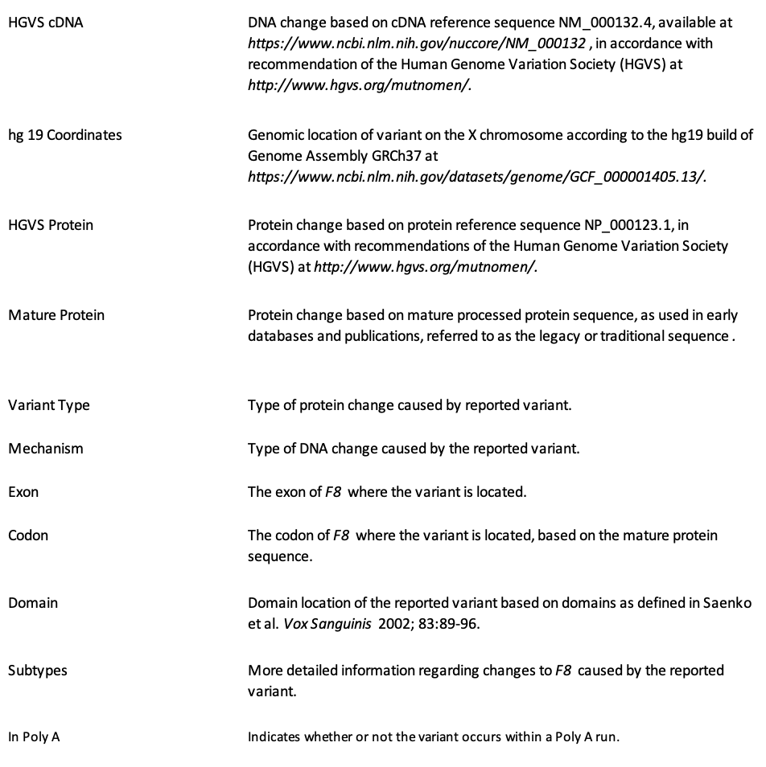

# Hemophilia_Statistical_Analysis
This study examines genetic variants associated with severe Hemophilia A (Factor VIII deficiency) using data from the CDC's CHAMP database. Download the PDF to see the full report.

## Abstract

This study examines genetic variants associated with severe Hemophilia A (Factor VIII deficiency) using data from the CDC's CHAMP database. Statistical analyses revealed significant associations between variant types and mechanisms (p \< 0.001), with missense substitutions and frameshift deletions being the most common. Coding regions and mixed exon-intron regions were frequently linked to severe cases. Genomic coordinates showed broader distributions in severe cases (p \< 2.2e-16). Additional tests confirmed associations with specific gene domains, subtypes, and codons (p \< 0.0005).

Notably, mixed exon-intron regions were exclusively linked to severe cases, suggesting a distinct functional role. Poly-A regions were frequently observed in severe cases. Additionally, synonymous variants, often associated with minimal functional impact, appeared in several severe cases, indicating a potential area for further exploration. These findings align with existing genetic research on Hemophilia A, while also highlighting underresearched areas for further investigation.

## **Research Question**

What are the most frequently reported causative genetic variants and their genomic locations associated with severe Hemophilia A (Factor VIII deficiency) in this dataset?

This analysis is based on reported unique genetic variants from the dataset, which is structured to highlight the diversity and characteristics of causative variants rather than provide a representative sample of the Hemophilia population.

## **Background Information**

Hemophilia is a bleeding disorder in which the blood does not clot properly because it is missing clotting factors. The condition is inherited genetically, or more rarely acquired. Whether inherited or acquired, a genetic mutation leads to this factor deficiency. People with severe Hemophilia A (less than 1% of clotting factor VIII baseline, compared to normal baselines of 50-150%) must take weekly medicine in order to provide their bodies with the needed factor replacement. This helps prevent bruises and internal bleeding in joints, along with serious and life-threatening internal bleeding.

## **Cases**

**What are the cases, and how many are there?**

2539 of 4038 records exist for people with severe Hemophilia A (compared to other clinical severity levels). We must note that this dataset excludes those who are "female or had more than one X chromosome or copy of F8 present" as they stated it "prevent\[s\] clear determination of the variant phenotype".

## **Data Collection**

**Describe the method of data collection.**

"The original database was developed to support the Hemophilia Inhibitor Research Study (HIRS) at the CDC, which enrolled more than 1,000 people with hemophilia, to allow accurate reporting and record-keeping...The first CHAMP Mutation List was posted online at the CDC.gov website in 2011...The database was compiled from existing literature reports and databases to include the first identifiable report of each novel F8 variant reported to cause hemophilia A...It was compiled from mutations listed originally in the Haemophilia A Mutation, Structure, Test and Resource Site (HAMSTeRS), as well as those from more than 350 additional publications...They are listed as Year 0 in the current database if the date of initial publication is not known. At the time of download, HAMSTeRS included 943 unique variants. The initial CHAMP Mutation List included 2,537 unique variants."

This database is an activity of the Division of Blood Disorders and Public Health Genomics in the National Center on Birth Defects and Developmental Disabilities of the Centers for Disease Control and Prevention.

## **Type of Study**

**What type of study is this (observational/experiment)?**

This study is observational.

## **Data Source**

[CDC Hemophilia Mutation Projects (CHAMP and CHBMP) (linked)](https://www.cdc.gov/hemophilia/mutation-project/index.html)

“The CHAMP F8 (factor VIII \[8\]) mutation list is an Excel database containing more than 4,000 changes in the F8 gene that have been reported to cause hemophilia A…Each mutation has been reviewed and uniquely identified using the Human Genome Variation Society nomenclature for DNA and predicted protein changes, as well as using traditional nomenclature based on the mature processed protein.”

It's essential to note that in this dataset: "Each entry represents a single report of the given variant. Multiple reports of each variant are not collected, unless they occurred in the same calendar year, in which case they are incorporated into a single listing as the first report. The CDC Variant Lists therefore do not include a group of people with the same variant and cannot be assumed to be representative of all people with the reported variant. Their use for phenotypic analysis is therefore limited."

{width="350"}

## **Response Variable**

**What is the response variable, and what type is it (numerical/categorical)?**

The response variable is: Reported Clinical Severity and it is categorical.

## **Explanatory Variable/s**

**What is the explanatory variable(s), and what type is it (numerical/categorical)?**

Multiple explanatory variables exist: HGVS cDNA (categorical), hg 19 Coordinates (numerical), HGVS Protein (categorical), Mature Protein (categorical), Variant Type (categorical), Mechanism (categorical), Exon (categorical), Codon (categorical), Domain (categorical), Subtype (categorical), and in Poly A (categorical). Field definitions are included in the dataset. We also have Year Reported, which is a numerical variable.

We’re not including these columns: severe, moderate, mild, no fvIII, history of inhibitor, comments, reference number, newly added in this current version. We'll use the Reported Clinical Severity column.
